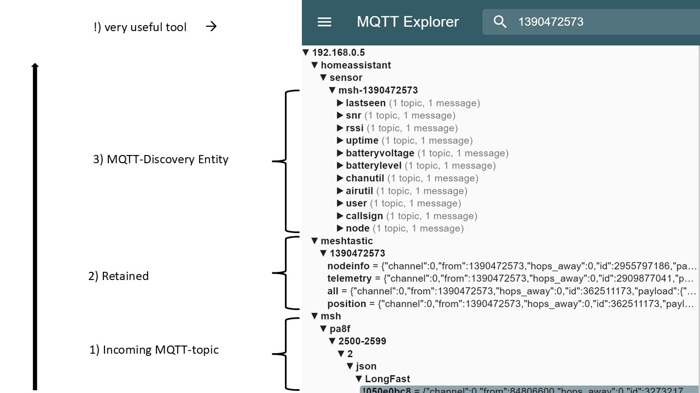
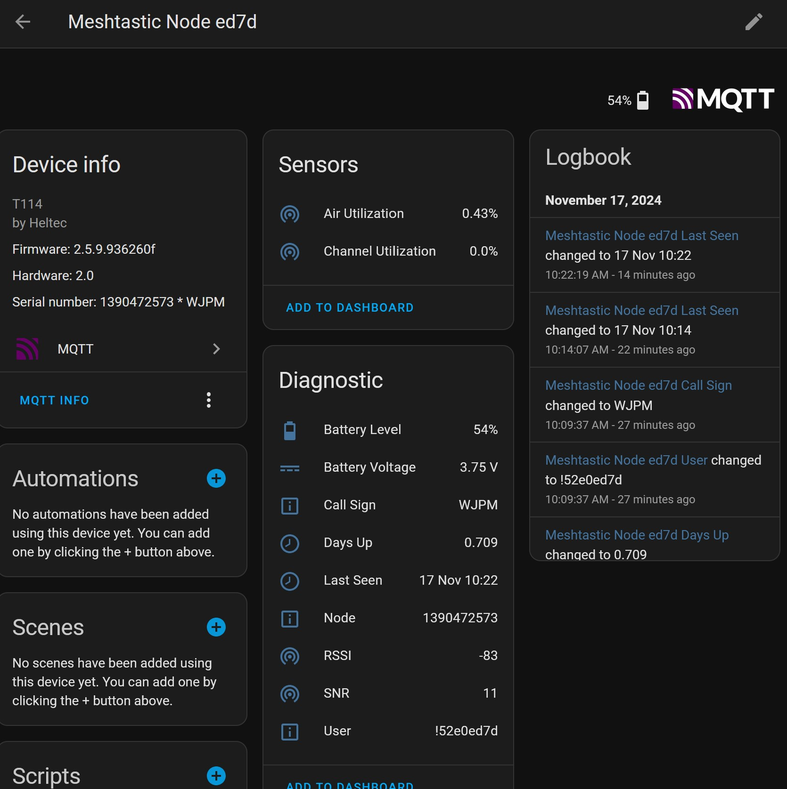

# Meshtastic-MQTT-Discovery
Home Automation Scripts and Automations to setup a Meshtastic Node as a Device

Words will forllow but here are the pictures:

The result looks like this and yes 

On your MQTT-broker

