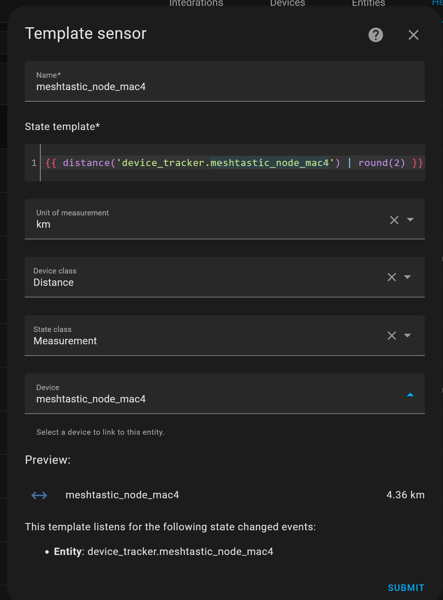

# Meshtastic-MQTT-Discovery
Home Automation Script and Automation to setup a Meshtastic Node as a Real Device in Home Assistant

When I started my objective was to see a Meshtastic Node as 1 device. After a lot of wrong intents and 'kommaneuken' I decided to abandon YAML (but I still prefer packages to keep everything of a project in 1 file) and do this directly in Home Assistant where mistake are noticed directly. This is the endresult:

<h2>Requirement(s)</h2>

There is only 1 requirement and that is that you have your <b>own</b> MQTT-broker, a semi-requirement is that inside your own broker you setup a <b>MQTT Bridge</b> to a Meshtastic MQTT broker. How to do this is beyond the scope of this documentation and is much better explained elsewhere like <a href="https://www.meshnet.nl/setup-mqtt-bridge.html">here</a> however in Dutch. <b>WARNING: publish inside your own broker and not in other mans broker !!!!!</b>. When your broker part is setup correctly you may create a new automation and copy the content of file "AUTOMATION - Meshtastic Node - retain topics.yaml" (if you prefer other textual methods you might need to change the intent etc). Before you activate you need to update the <b>TOPiC</b> lines:

topic: msh/pa8f/<zip_code_range>/2/json/LongFast/<your_mqtt_node>

With your details. This automation will publish the incoming JSON topic into seperate and retained topics. The topics are extended with the FROM and TYPE fields, if the TYPE=telemetry this is even more differentiated by type of metric: device, environment and power. The result (2-retained) looks in MQTT-explorer like this: 

Note: If your Mesh is big you might want to limit this by selecting only the nodes of your scope.

<h2>MQTT Discovery</h2
                    
To discover each Meshtastic Node. You need to run the script "SCRIPT - Meshtastic Node mac4 MQTT Discovery.yaml". Before you run this script you need to change: 
    <ul>
      <li>mac4 in an unique identifier (I use the mac4 extention of the device)</li>
      <li>nodid into the value of FROM field of the new device</li>
      <li>set each "discover_" variable to true/false if it needs to be included or not</li>
      <li>update the details of the device, "identifiers" and "name" are already updated in previous steps, you may remove the rest but watch out for the last missing komma</li>
    </ul>
Some changes needs to repeated so a "replace all" is better. After the updates you only need to run this script once. this will create the dicovery settings under the "homeassistant" (see MQTT-discovery entity" in previous picture).If this device or one of its sensors become obsolete you can delete this directly in MQTT-explorer.

NOTE: Not every possible sensor is already included but hopefully this setup is easy enough to extend this.

<h2>Template Sensor</h2

You can create also an additional template sensor in Settings - Device - Helper, this sensor will calulate the distance of a node to Home with this template:
{{ distance('device_tracker.meshtastic_node_mac4') | round(2) }}
See for further required settings the picture below:

As you can see you also be able to link this sensor with the device itself (It is funny that is is not possible to link the device_tracker to the device).
This action is only relevant if the node has a position and in the script "discover_GPS: true" when the script was run for this node.
